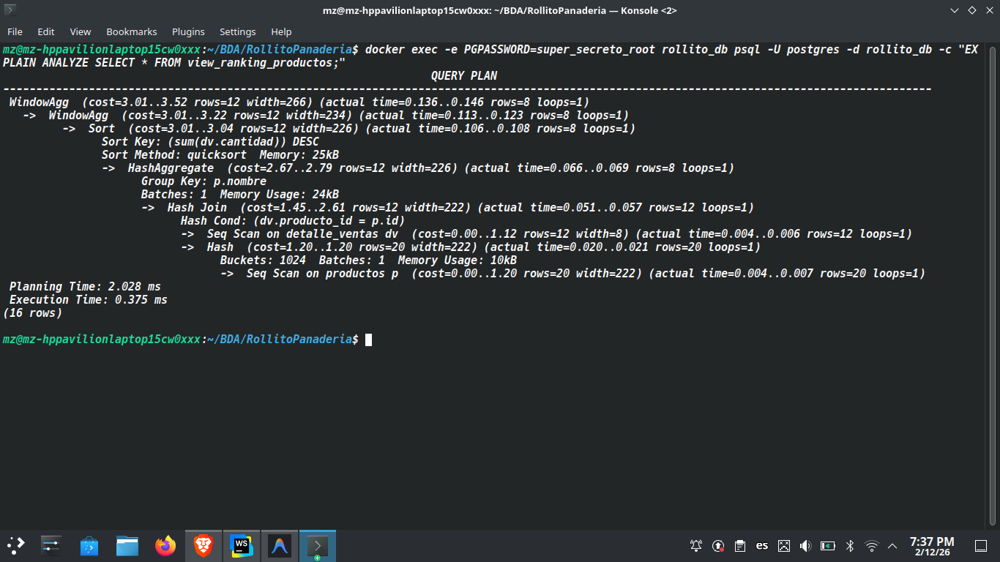
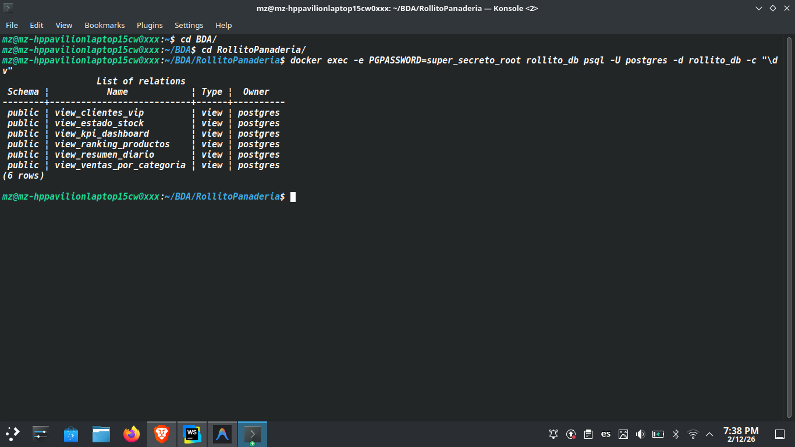

## Rollito Panadería - Lab Reportes SQL
Sistema de reportes de ventas para una panadería utilizando Next.js, PostgreSQL y Docker Compose. Este proyecto implementa un dashboard financiero que consume vistas materializadas y optimizadas directamente de la base de datos, garantizando rendimiento y seguridad mediante principios de menor privilegio.

## Tecnologías
Frontend: Next.js 14 (App Router), Tailwind CSS.

Backend: Node.js (Server Components para seguridad).

Base de Datos: PostgreSQL 15 (Alpine).

Seguridad: Zod (Validación de Inputs), Roles de usuario limitados (REVOKE/GRANT), Inyección de variables de entorno.

Infraestructura: Docker Compose.

## Instalación y Ejecución (One Command)
El proyecto utiliza una arquitectura de inyección de secretos. No se requieren configuraciones manuales de SQL.

Clonar el repositorio:

```bash

git clone https://github.com/Jesel8D/243692-5B-Tarea6
cd RollitoPanaderia
Configurar Variables de Entorno: Copiar el archivo de ejemplo y crear el archivo .env (este archivo no se sube al repositorio por seguridad):
```
```bash

cp .env.example .env
Nota: Docker Compose leerá este archivo automáticamente para configurar la base de datos y la conexión de la app.
```
Levantar el entorno:

```bash

docker compose up --build
El sistema ejecutará automáticamente los scripts 01_schema, 02_seed, 03_reports, 04_indexes y 05_roles en orden determinista.
```

Acceder:

Dashboard: http://localhost:3000

### Modelo de Amenazas (Threat Model)
Para cumplir con los requisitos de "Seguridad Real", se implementaron las siguientes medidas:

Principio de Menor Privilegio (Least Privilege): La aplicación NO se conecta como postgres (root). Se conecta como webapp_user.

Aislamiento de Tablas: Mediante el script 05_roles.sh, se revocaron explícitamente los permisos sobre las tablas base (REVOKE ALL ON TABLES). Si la app intenta hacer un SELECT * FROM ventas, la base de datos bloqueará la consulta. Solo tiene acceso GRANT SELECT a las 5 Vistas específicas.

Inyección de Secretos: Las contraseñas no están hardcodeadas en el código fuente ni en los archivos SQL. Se inyectan desde el .env al momento de levantar el contenedor.

Validación de Inputs: Se utiliza Zod en el servidor para validar los parámetros de URL (filtros), previniendo datos malformados antes de que toquen la base de datos.

### Trade-offs: SQL vs Next.js
Decisiones técnicas sobre dónde procesar los datos:

Lógica de Negocio en SQL (Views): Decidí usar CASE, CTE y Window Functions (Rank) directamente en Postgres.

Por qué: Es más eficiente filtrar y agregar datos en el motor de base de datos antes de enviarlos por la red. Reducimos el payload hacia Next.js.

Formato en Next.js: El formateo de moneda ($) y fechas se delegó al frontend (Intl.NumberFormat).

Por qué: Permite que la presentación se adapte al locale del usuario sin complicar la query SQL con strings.

Server Components: Todo el data fetching ocurre en el servidor.

Por qué: Nunca exponemos la conexión a la base de datos ni las credenciales al navegador del cliente.

## Evidencia de Performance (Índices y EXPLAIN)
Se crearon índices en db/04_indexes.sql para optimizar las uniones y filtros.

### 1. Justificación de Índices
  idx_productos_categoria: Optimiza el JOIN en la View 1 (Ventas por Categoría).

idx_ventas_fecha: Crítico para la View 5 (Resumen Diario), permitiendo agregaciones rápidas por fecha.

idx_detalle_producto: Acelera el GROUP BY en las Views 2 y 3 para sumarizar ventas sin scan completo.

### 2. Evidencia EXPLAIN ANALYZE
   A continuación se muestra la diferencia de costo al consultar el Ranking de Productos (View 2) usando el índice:

Comando ejecutado:

SQL

EXPLAIN ANALYZE SELECT * FROM view_ranking_productos;
Resultados:


*(Inserta aquí tu captura de pantalla del comando EXPLAIN)*

## Estructura de Base de Datos (Views)
El sistema se basa en 5 Vistas Materializadas Lógicas:

view_ventas_por_categoria: Usa CTE y CASE para calcular rentabilidad.

view_ranking_productos: Usa Window Function (RANK) para determinar popularidad.

view_clientes_vip: Usa HAVING para filtrar clientes de alto valor.

view_estado_stock: Usa COALESCE para manejo de nulos y clasificación de inventario.

view_resumen_diario: Agregación temporal con índices de fecha.

Evidencia de creación (\dv):


*(Inserta aquí tu captura de pantalla del comando \dv)*

Instrucciones para el Profesor/Revisor
Para verificar la seguridad:

Entrar al contenedor de la app: docker exec -it rollito_web sh

Intentar ver las variables: printenv DATABASE_URL (Verá la conexión correcta).

Entrar a la DB con ese usuario y tratar de leer una tabla directa: SELECT * FROM ventas; (Debería dar error de permisos).

## Bitácora de Uso de IA
Se utilizó asistencia de IA (Google DeepMind Agent) para:
1.  **Auditoría de Seguridad**: Identificación de vulnerabilidades en Docker (root user) y exposición de puertos.
2.  **Refactoring de Código**: Centralización de la lógica de acceso a datos en `lib/queries.ts` para reportes que usaban SQL directo.
3.  **Generación de Scripts**: Creación de `verify.sh` para validación automatizada de las vistas.

### Prompts Clave Utilizados:
- *"Actua como un senior en desarrollo de software y revisa si mi proyecto cumple alguna mala practica..."* -> Generó el reporte de auditoría inicial.
- *"Ayudame a revisar si se cumple todo lo que nos piden de la actividad..."* -> Realizó el análisis de brechas (Gap Analysis) contra los requisitos de la Tarea 6.
- *"ahora con que comandos borro todo lo que ya se habia creado del docker..."* -> Asistió en los comandos de limpieza de volúmenes Docker.

### Verificación Humana:
- Se validó manualmente que el usuario `nextjs` dentro del contenedor no tuviera permisos de root.
- Se verificó que las queries SQL generadas por la IA coincidieran con el esquema de la base de datos.